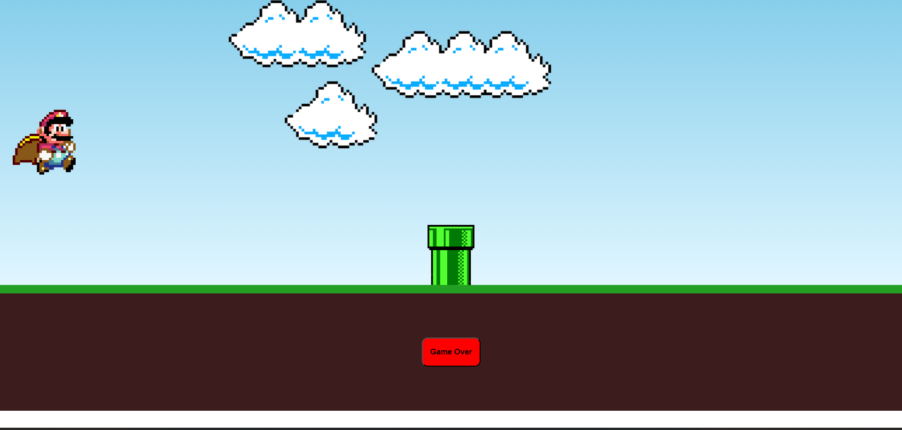

<h1 align="center"> Mario Jump </h1>

Jogo simples usando HTML, CSS e JavaScript.  

  <a href="#-tecnologias">Tecnologias</a>&nbsp;&nbsp;&nbsp;|&nbsp;&nbsp;&nbsp;
  <a href="#-projeto">Projeto</a>

 

  

## 🚀 Tecnologias

Esse projeto foi desenvolvido com as seguintes tecnologias:

- HTML e CSS
- JavaScript
- Git e Github

## 💻 Projeto

Este projeto é um jogo simples inspirado no clássico Mario, desenvolvido para fins de aprendizado e prática das tecnologias web: HTML, CSS e JavaScript. O objetivo é criar uma experiência de jogo básica onde o personagem principal pode pular e interagir com elementos do cenário.

- [Acesse o projeto finalizado, online](https://luishmonteiro.github.io/MarioGame)